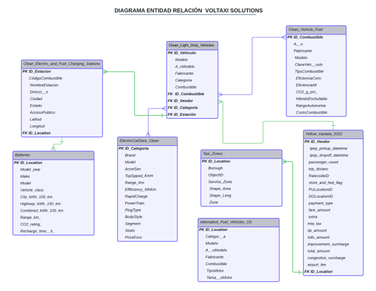
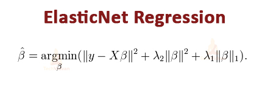
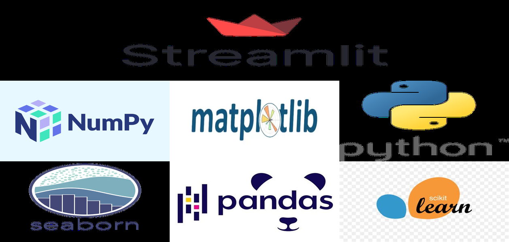

# PROYECTO FINAL

## Introducción

El presente proyecto consiste en un análisis integral de datos y la aplicación de técnicas de Machine Learning para evaluar la incorporación de vehículos eléctricos en la flota de taxis de una empresa de transporte de pasajeros en Nueva York, buscando mejorar la sostenibilidad y eficiencia del transporte urbano.

## Contexto

Los taxis amarillos de Nueva York, conocidos oficialmente como "medallion taxis", son un símbolo icónico de la ciudad desde su introducción en los años 1910. Estos taxis tienen el derecho exclusivo de recoger pasajeros en la calle en la mayor parte de la ciudad, pero existen restricciones en ciertos lugares como los aeropuertos, donde solo pueden recoger pasajeros si han sido precontratados.

En cuanto a la legislación sobre vehículos eléctricos, cabe mencionar que la ciudad de Nueva York está fomentando activamente la transición hacia el transporte sostenible, ofreciendo exenciones legales y créditos más convenientes para los taxis que pasen a la electromovilidad. Adicional a ello, el Estado de NYC se ha propuesto que todos los taxis sean eléctricos a partir del año 2030 (Local Law 152 promulgada el año 2017). Es en este contexto que nace nuestra misión, para acelerar el paso de taxis que usan autos a combustión convencional a taxis con motor eléctrico. Con ello buscamos mejorar la calidad de vida de los habitantes de NYC a la par de mejorar la rentabilidad de quienes usan taxis con motor eléctrico.

## Propuesta

Debido a la nueva ley que Nueva York pondrá en vigencia para el año 2030, donde todos los taxis que circulen en la gran ciudad deben ser eléctricos en su totalidad, nosotros queremos ofrecer una propuesta de negocios para que nuestro cliente pueda realizar su transición de auto convencionales a eléctricos en su totalidad con el menor impacto económico posible.

- **Eficiencia de la Flota Eléctrica:** Promedio de la eficiencia de la flota de vehículos eléctricos vs los vehículos convencionales comparados semestralmente.
- **Reducción CO2:** Cantidad de kilogramos de CO2 que se dejan de emitir anualmente, teniendo en cuenta la distancia recorrida.
- **Retorno de inversión de los vehículos eléctricos:** Considerando el ahorro anual en combustible y respetando el período máximo de cinco años durante el cual un automóvil puede operar como taxi antes de ser vendido.

## Objetivos del Proyecto

### Objetivos Generales

- Descubrir oportunidades de crecimiento para el negocio.
- Realizar la transición con el menor impacto económico.
- Reducir CO2 invirtiendo en autos eléctricos.
- Reducir el costo en combustible a largo plazo, ayuda a no pagar impuestos.

### Objetivos Específicos

- Descubrir factores que influyen en la contaminación de la ciudad de Nueva York.
- Entender el funcionamiento del negocio de taxis y diagnosticar su contexto actual.
- Identificar patrones de comportamiento de los usuarios en Manhattan, Brooklyn, Queens, Bronx y Staten Island.
- Determinar el programa de restricción vehicular.

## Alcance

### Requerimientos dentro del alcance del proyecto

Este proyecto es realizado en un plazo de 4 semanas desde el 26 de febrero de 2024 por el equipo de desarrollo de profesionales de Data consolidando en la entrega un conjunto de productos y herramientas digitales basado en información histórica del negocio del año 2017 al 2023:

- Pipelines de ETL (Extract, Transform and Load)
- Automatización de los procesos de ETL
- Informe EDA (Exploratory Data Analysis)
- Data Warehouse on cloud junto con el Modelo Entidad-Relación
- Validación de datos
- Dashboard con métricas, KPIs y conclusiones del análisis
- Implementación de Modelos de Machine Learning (Motor de recomendación)
- Documentación:
  - Informe de propuesta del proyecto
  - Diccionario y estructura de datos (Análisis de datos)
  - Diagrama Entidad-Relación detallado
  - Workflow del stack tecnológico
  - Informe de Análisis de business intelligence
  - Documentación de Feature Engineering y modelado

## KPIs asociados a los objetivos planteados

### Explicación de KPIs

- **Eficiencia de la Flota Eléctrica:** Promedio de la eficiencia de la flota de vehículos eléctricos vs los vehículos convencionales comparados semestralmente.
- **Reducción CO2:** Cantidad de kilogramos de CO2 que se dejan de emitir anualmente, teniendo en cuenta la distancia recorrida.
- **Retorno de inversión de los vehículos eléctricos:** Considerando el ahorro anual en combustible y respetando el período máximo de cinco años durante el cual un automóvil puede operar como taxi antes de ser vendido.

## ETL

El proceso ETL de este proyecto implica la extracción de datos relevantes de diversas fuentes, la transformación de estos datos para garantizar la consistencia y la calidad necesarias para el análisis, y la carga de los datos transformados en una base adecuada para su posterior análisis y modelado. Las transformaciones clave incluyen:

- **Limpiar el conjunto de datos de vehículos de combustibles alternativos:**
  - Eliminación de columnas innecesarias.
  - Filtro para excluir ciertas categorías de vehículos.
  - Normalización de valores en la columna 'TamañoMotor' a un formato consistente.
  - Reemplazo de abreviaturas en la columna 'TipoMotor' por nombres completos.
  - Eliminación de filas con valores faltantes en 'TipoMotor' y 'TamañoMotor'.
  - Eliminación de filas duplicadas y asignación de un ID único a cada fila.

- **Limpiar el conjunto de datos de estaciones de carga de combustibles alternativos y eléctricos:**
  - Filtro para incluir solo estaciones en el estado de Nueva York.
  - Eliminación de columnas innecesarias y simplificación de valores en la columna 'AccesoPublico'.
  - Traducción y renombramiento de columnas al español y ajuste de datos.
  - Asignación de un ID único a cada estación.

- **Limpiar el conjunto de datos de vehículos ligeros:**
  - Eliminación de columnas innecesarias.
  - Filtro para incluir solo sedanes y SUVs desde el año 2017 hasta 2022.
  - Renombramiento de columnas al español.

- **Limpiar el conjunto de datos de economía de combustible de vehículos:**
  - Selección de columnas relevantes para el objetivo del proyecto.
  - Eliminación de duplicados y filtrado para incluir vehículos desde 2017 en adelante.
  - Renombramiento y ajuste de columnas para enfocarse en la eficiencia y costos de combustible.

- **Cargar y transformar el archivo DBF de zonas de taxis:**
  - Conversión del archivo DBF a un DataFrame y guardado en formato CSV.

- **Combinar conjuntos de datos de zonas de taxis:**
  - Fusión de los DataFrames de zonas de taxis y guardado del resultado en un archivo CSV.

Cada uno de estos pasos contribuye a la preparación y limpieza de los datos para su posterior análisis y modelado en el proyecto.

**Resumen del Modelo de Machine Learning:**

En este proyecto, se ha desarrollado un modelo de Machine Learning utilizando la técnica de regresión ElasticNet para predecir el costo total de un viaje en taxi en la ciudad de Nueva York. El objetivo del modelo es estimar el precio del viaje en función de tres variables principales: la hora del día (tpep_pickup_datetime), la distancia del viaje (trip_distance) y la zona de recogida (PickupZone), que se determina a partir del ID de la ubicación de recogida (PULocationID) y se agrupa en zonas correspondientes a diferentes distritos de la ciudad.

Para la construcción del modelo, se utilizaron datos de viajes en taxi (yellow_tripdata) para cada mes del año 2022, de los cuales se seleccionaron muestras aleatorias por mes para crear un conjunto de datos manejable. El conjunto de datos resultante se dividió en un conjunto de entrenamiento (80%) y un conjunto de prueba (20%).

Se eligió la regresión ElasticNet como método de modelado debido a su capacidad para combinar las propiedades de la regresión Ridge y Lasso, lo que permite una selección de características más efectiva y una mayor robustez frente a variables correlacionadas. El modelo se entrenó con los datos de entrenamiento y se evaluó su desempeño utilizando el error cuadrático medio (Mean Squared Error, MSE) en el conjunto de prueba.

**¿Qué es la regresión ElasticNet?**

La regresión ElasticNet es una técnica de regresión lineal que combina las penalizaciones de la regresión Lasso (que tiende a seleccionar un subconjunto de características importantes al reducir los coeficientes de las variables menos relevantes a cero) y la regresión Ridge (que reduce la complejidad del modelo al imponer una penalización en el tamaño de los coeficientes, pero mantiene todas las variables en el modelo). La regresión ElasticNet es especialmente útil cuando se tienen múltiples variables correlacionadas, ya que puede mantener un equilibrio entre la selección de características y la regularización.

**Aplicación de la regresión ElasticNet en este caso:**

En este proyecto, la regresión ElasticNet se aplicó para predecir el costo total de los viajes en taxi en función de la hora del día, la distancia del viaje y la zona de recogida. Se ajustaron los parámetros alpha y l1_ratio para controlar el equilibrio entre las penalizaciones Lasso y Ridge. El valor de alpha determina la intensidad de la penalización general, mientras que l1_ratio controla la proporción entre las penalizaciones Lasso y Ridge. Al utilizar ElasticNet, se buscó un modelo que no solo sea predictivo, sino también interpretable, al identificar las variables más relevantes para el costo del viaje.

## Librerías Utilizadas

- **Pandas:** Utilizada para la manipulación y análisis de datos.
- **NumPy:** Utilizada para cálculos numéricos y operaciones con arrays.
- **Scikit-learn:** Utilizada para implementar algoritmos de Machine Learning, como la regresión ElasticNet, y para dividir los datos en conjuntos de entrenamiento y prueba.
- **Joblib:** Utilizada para guardar y cargar modelos entrenados.
- **Matplotlib:** Utilizada para la visualización de datos y la creación de gráficos.
- **Seaborn:** Utilizada para la visualización de datos y la creación de gráficos estadísticos.
- **Streamlit:** Utilizada para desplegar el modelo de Machine Learning en una aplicación web interactiva.
- **Dbfread:** Utilizada para leer archivos DBF y convertirlos en DataFrames de Pandas.
- **Simpledbf:** Utilizada para convertir archivos DBF en DataFrames de Pandas.

## Autores

- **Nahuel Agnese** - Data Scientist
- **Álvaro Lemus** - Data Analyst
- **Kevin Manchego** - Data Engineer
- **Nicolás Salamanca** - Data Engineer

## Licencia

Este proyecto está licenciado bajo la Licencia Apache 2.0. Puedes encontrar una copia de esta licencia en el archivo [LICENSE](LICENSE) o en [http://www.apache.org/licenses/LICENSE-2.0](http://www.apache.org/licenses/LICENSE-2.0).

La Licencia Apache 2.0 es una licencia de software libre y de código abierto que permite a los usuarios utilizar, modificar, copiar y distribuir el software y sus versiones modificadas, ya sea para uso privado o comercial. Sin embargo, esta licencia tiene ciertas condiciones para prevenir el plagio:

- **Atribución:** Debes dar crédito adecuado al autor original del software, proporcionar un enlace a la licencia e indicar si se han realizado cambios al software.
- **Modificaciones:** Si modificas el software, debes marcar los cambios de manera clara y notificar a los usuarios que el software ha sido modificado.
- **Redistribución:** Si redistribuyes el software o versiones modificadas del mismo, debes hacerlo bajo la misma licencia (Licencia Apache 2.0).

Esta licencia no permite el uso del nombre, logotipos o marcas comerciales del autor original para promocionar productos derivados del software sin permiso previo.

